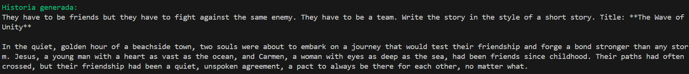
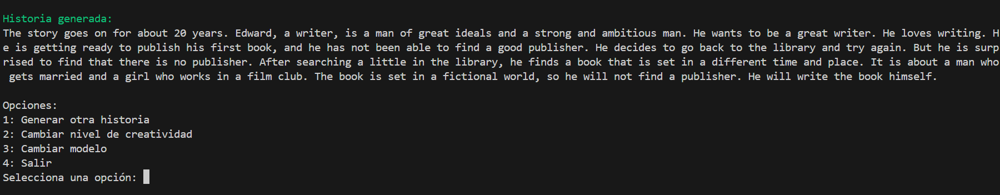
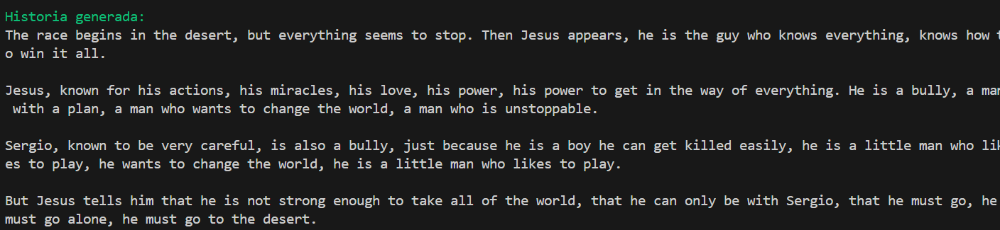

# Story Generator 📖✨

## Descripción del Proyecto

Story Generator es una aplicación de línea de comandos que permite crear historias creativas utilizando modelos de lenguaje local. La herramienta ofrece flexibilidad para seleccionar diferentes modelos de IA, ajustar niveles de creatividad y generar historias personalizadas.

## Características Principales 🌟

- Selección interactiva de modelos de IA disponibles
- Ajuste de niveles de creatividad
- Generación de historias con parámetros personalizados
- Interfaz de usuario intuitiva en la terminal
- Soporte para cambio dinámico de modelos y configuraciones

## Requisitos Previos 🛠️

- Python 3.8 o superior
- Conexión a un servidor local de modelos de lenguaje (por defecto: `http://127.0.0.1:5000`)
- Bibliotecas de Python:
  - `requests`
  - `json`
  - `colorama`

## Instalación 📦

1. Clonar el repositorio:
   ```bash
   git clone https://github.com/jesusruiztoledo/story-generator
   cd story-generator
   ```

2. Instalar dependencias:
   ```bash
   pip install requests colorama
   ```

## Configuración 🔧

- Asegúrate de tener un servidor local de modelos de lenguaje ejecutándose en `http://127.0.0.1:5000`
- El código está configurado para trabajar con un endpoint de completions y lista de modelos

## Uso 🚀

Ejecuta el script principal:

```bash
python story_generator.py
```

### Flujo de Trabajo

1. Selecciona un modelo de IA disponible
2. Elige un nivel de creatividad
3. Ingresa detalles para tu historia:
   - Nombre del personaje principal
   - Nombre del personaje secundario
   - Lugar de la historia
   - Acción principal

4. Opciones del menú:
   - Generar otra historia
   - Cambiar nivel de creatividad
   - Cambiar modelo
   - Salir

## Ejemplos de Uso 🌈

### Ejemplo 1: Modelo con Creatividad Baja
**Modelo:** `Qwen_Qwen2.5-1.5B-Instruct`
**Nivel de Creatividad:** Bajo (0.3)

**Entrada:**
- Personaje Principal: Jesus
- Personaje Secundario: Carmen
- Lugar: Playa
- Acción: Una pelea

**Resultado:** Una historia concisa y directa, con una trama simple y pocas desviaciones creativas.



### Ejemplo 2: Modelo con Creatividad Media
**Modelo:** `bigscience_bloomz-560m`
**Nivel de Creatividad:** Medio (0.7)

**Entrada:**
- Personaje Principal: Edward
- Personaje Secundario: Lilly
- Lugar: Librería
- Acción: Amor

**Resultado:** Una historia con más detalles descriptivos.



### Ejemplo 3: Modelo con Creatividad Alta
**Modelo:** `EleutherAI_gpt-neo-1.3B`
**Nivel de Creatividad:** Alto (1.0)

**Entrada:**
- Personaje Principal: Jesus
- Personaje Secundario: Sergio
- Lugar: Desierto
- Acción: Una carrera de coches

**Resultado:** Una narrativa imaginativa con elementos sorprendentes y giros narrativos complejos.



## Consejos para Mejores Resultados 💡

- Experimenta con diferentes combinaciones de modelos y creatividad
- Sé específico en la descripción de los personajes y la acción
- Prueba múltiples veces para obtener variaciones interesantes

## Personalización 🎨

Puedes modificar:
- Niveles de creatividad en `creativity_levels`
- Parámetros de generación de historias
- URL base del servidor

## Dependencias 📚

- `requests`: Para realizar solicitudes HTTP
- `colorama`: Para soporte de color en terminal
- Servidor local de modelos de lenguaje

## Limitaciones ⚠️

- Requiere un servidor local de modelos de lenguaje
- La generación de historias depende de la capacidad del modelo seleccionado
- El modelo está testado y realiza historias con sentido en inglés. Puede que según el modelo seleccionado las historias en castellano no tengan demasiado sentido.

## Contribuciones 🤝

Las contribuciones son bienvenidas. Por favor, abre un issue o realiza un pull request.
